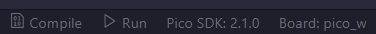

# Conversor Analógico-Digital Usando PWM e Joystick

## Descrição 📝
Este projeto utiliza a placa **BitDogLab** para explorar conceitos de conversão analógico-digital, simultaneamente fazendo uso do PWM para controle de leds. 🛠️

---

## Funcionalidades 🎮
Alguns botões das placas possuem algumas funcionalidades:

- **Joystick**: O movimento do joystick é representado por um quadrado 8x8 no led. Movimentar ao longo dos eixos **X** e **Y** aciona respectivamente o
**LED Vermelho**❤️ e o **LED Azul**💙 de maneira proporcional à distância da posicão central do joystick.
- **Botão do Joystick**: Alterna o estado do **LED Verde**💚 e muda a borda do display OLED.
- **Display**: Exibe um quadrado para representar o movimento do joystick 📟.
- **Botão A**: Alterna o estado do **PWM** dos **LEDs Vermelho** e **Azul**.

[**Vídeo de Demonstração** 🎥](https://youtube.com/shorts/w3HyJ3UWnhE?feature=share)

---

## Como Compilar 🛠️
Para compilar o programa, siga os passos abaixo:

1. Configure o ambiente de desenvolvimento para o **Raspberry Pi Pico**.
2. Utilize um compilador C compatível para gerar os arquivos `.uf2` e `.elf`.

Exemplo de botão de compilação:

---

## Como Executar ⚡

1. Conecte a placa **BitDogLab** via cabo **micro-USB** 🔌.
2. Ative o modo **BOOTSEL** da placa.
3. Clique no botão **Run** ▶️.
4. Pressione ou movimente o **Joystick**, além do **Botão A** para usufruir das funcionalidades🎮.

---

## Requisitos 📋

- Compilador C (ex: **gcc** ou equivalente) 🖥️.
- Sistema operacional compatível com programas em C.
- Extensão **Raspberry Pi Pico**.
- Placa **BitDogLab**.

---
